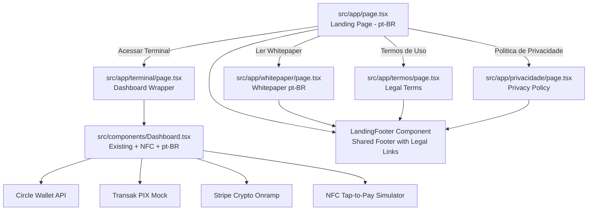

# Valence Platform - pt-BR Expansion Plan

## Overview

Incremental update to the existing Rendey/Valence crypto-fiat platform adding Brazilian Portuguese localization, legal pages, a technical whitepaper, and NFC Tap-to-Pay functionality — without breaking any existing code.

## Architecture Overview

## File Change Summary

| File | Action | Description |
|------|--------|-------------|
| `src/app/layout.tsx` | MODIFY | Change `lang="en"` to `lang="pt-BR"`, update metadata to Portuguese |
| `src/app/page.tsx` | REWRITE | Transform from Dashboard wrapper into a full pt-BR landing page |
| `src/app/terminal/page.tsx` | CREATE | New route wrapping existing Dashboard component |
| `src/app/termos/page.tsx` | CREATE | Termos de Uso page referencing Rendey LLC |
| `src/app/privacidade/page.tsx` | CREATE | Politica de Privacidade page |
| `src/app/whitepaper/page.tsx` | CREATE | Technical whitepaper in pt-BR |
| `src/components/LandingFooter.tsx` | CREATE | Shared footer component with legal links |
| `src/components/Dashboard.tsx` | MODIFY (ADD only) | Add NFC section, translate UI strings to pt-BR |

## Critical Constraints

1. **Zero breaking changes** — All existing API routes (`/api/wallet/generate`, `/api/stripe/onramp-session`) remain untouched
2. **Dashboard preserved** — The existing Dashboard.tsx logic, state management, and API calls are preserved; only new UI sections and text translations are added
3. **TransakMockModal untouched** — No changes to the modal component
4. **Route migration** — The Dashboard moves from `/` to `/terminal` via a thin wrapper page; the landing page takes over `/`

## Step-by-Step Implementation

### Step 1: Update Root Layout (`src/app/layout.tsx`)

- Change `lang="en"` to `lang="pt-BR"` on the `<html>` tag
- Update `metadata.title` to `"Valence — Plataforma de Pagamento Cripto-Fiat"`
- Update `metadata.description` to Portuguese description of the platform
- No other structural changes

### Step 2: Create Terminal Route (`src/app/terminal/page.tsx`)

- Create a thin `"use client"` page component that simply renders `<Dashboard />`
- Add metadata for the terminal page in Portuguese
- This preserves the Dashboard at a new URL without breaking the component

### Step 3: Create Landing Footer Component (`src/components/LandingFooter.tsx`)

- Shared footer used by landing page, whitepaper, termos, and privacidade pages
- Contains: copyright "2026 Rendey LLC", links to "Termos de Uso" and "Politica de Privacidade"
- Dark mode styling consistent with the existing design system
- Accepts optional `variant` prop for landing vs. subpage styling

### Step 4: Rewrite Landing Page (`src/app/page.tsx`)

- Full pt-BR landing page with:
  - Hero section: product name "Valence", tagline about bridging fiat and Web3
  - Feature sections explaining: PIX/Cartoes → Solana settlement, NFC payments, non-custodial wallets
  - Architecture overview section (simplified visual)
  - Two CTA buttons: "Acessar Terminal" (links to `/terminal`) and "Ler Whitepaper" (links to `/whitepaper`)
  - LandingFooter at bottom
- Dark mode styling with gradient accents matching existing design
- No client-side state needed — static page with `export const metadata`

### Step 5: Create Termos de Uso (`src/app/termos/page.tsx`)

- Professional legal document in pt-BR
- References "Rendey LLC" as the operating entity
- Covers: service description, user obligations, non-custodial wallet disclaimers, transaction finality, limitation of liability, governing law
- Tailwind-styled as a clean reading document
- Includes LandingFooter

### Step 6: Create Politica de Privacidade (`src/app/privacidade/page.tsx`)

- Standard privacy policy in pt-BR
- Details: data collection, non-custodial wallet structure (private keys never stored by platform), cookie usage, third-party services (Transak, Stripe, Circle), user rights under LGPD
- Tailwind-styled document format
- Includes LandingFooter

### Step 7: Create Whitepaper (`src/app/whitepaper/page.tsx`)

- Professional technical document in pt-BR covering:
  - Executive summary
  - Architecture: Contactless NFC initiation flow
  - Fiat onramps: Transak (PIX) and Stripe Crypto Onramp
  - Circle Programmable Wallets for non-custodial custody
  - Solana Devnet for instant settlement
  - System flow diagram (text-based)
  - Security considerations
  - Roadmap
- Styled like an executive document with sections, headers, and code blocks where appropriate
- Includes LandingFooter

### Step 8: Add NFC Tap-to-Pay to Dashboard (`src/components/Dashboard.tsx`)

- **ADD** a new card section "NFC Tap-to-Pay (Aproximacao)" between the existing Deposit section and the Solana Pay section
- NFC module contains:
  - BRL amount input field
  - "Ativar Leitor NFC (Simulador)" button with distinct styling (e.g., orange/amber accent)
  - Three states: idle → scanning (pulse animation with "Aguardando aproximacao do celular/cartao...") → success (logged to simulated ledger)
  - The simulated ledger is a local `useState<NfcTransaction[]>` array displayed in a small table within the card
- **ADD** new imports: `Smartphone` from lucide-react, `NfcTransaction` interface
- **DO NOT** modify any existing function logic, API calls, or component structure

### Step 9: Translate Dashboard UI to pt-BR

- Translate all visible text strings in Dashboard.tsx to Portuguese:
  - "Your Wallet" → "Sua Carteira"
  - "Generate Wallet (Circle)" → "Gerar Carteira (Circle)"
  - "Generating wallet..." → "Gerando carteira..."
  - "Deposit / Fund Wallet" → "Depositar / Alimentar Carteira"
  - "SOL Balance" → "Saldo SOL"
  - "USDC Balance" → "Saldo USDC"
  - "Refresh balance" → "Atualizar saldo"
  - "Copy address" → "Copiar endereco"
  - "View on Explorer" → "Ver no Explorer"
  - "Solana Pay & Transfers" → "Solana Pay e Transferencias"
  - "Receive" → "Receber"
  - "Send" → "Enviar"
  - "Amount (SOL)" → "Valor (SOL)"
  - "Sending..." → "Enviando..."
  - "Send SOL" → "Enviar SOL"
  - Footer text to Portuguese
  - Alert messages to Portuguese
- **DO NOT** change any variable names, API calls, state management, or functional logic

### Step 10: Build Verification

- Run `next build` to verify zero compilation errors
- Verify all routes are accessible: `/`, `/terminal`, `/whitepaper`, `/termos`, `/privacidade`

## Risk Mitigation

| Risk | Mitigation |
|------|------------|
| Breaking existing Dashboard functionality | Only ADD new sections; translate text without changing logic |
| Next.js App Router conflicts | Each page is a separate route with no shared state |
| Missing imports | Use only existing dependencies (lucide-react, Tailwind) — no new packages needed |
| Build errors from metadata exports | Client components cannot export metadata; use layout or page-level metadata correctly |
| Dark mode consistency | All new pages use the same `bg-[#0a0b0d]` background and Tailwind dark styling as existing Dashboard |
